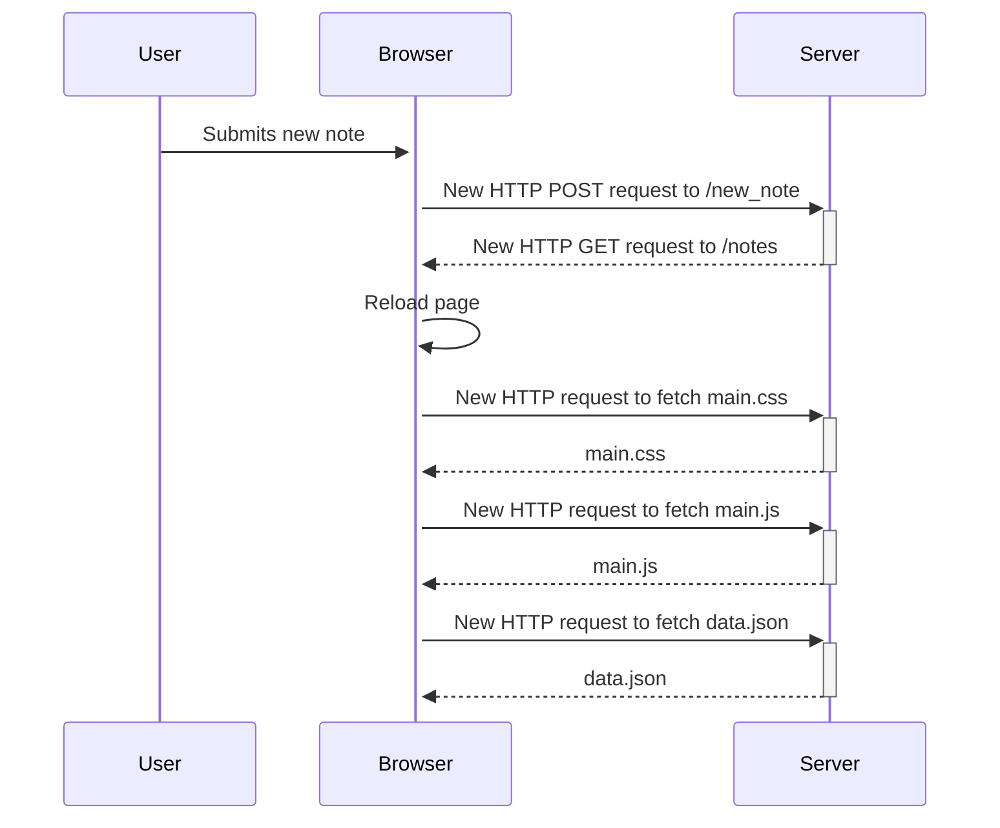

```mermaid
sequenceDiagram
    participant User
    participant Browser
    participant Server

    User->>+Browser: Submits new note
    Browser->>+Server: New HTTP POST request to /new_note
    Server-->>-Browser: New HTTP GET request to /notes
    Browser->>Browser: Reload page
    Browser->>+Server: New HTTP request to fetch main.css
    Server-->>-Browser: main.css
    Browser->>+Server: New HTTP request to fetch main.js
    Server-->>-Browser: main.js
    Browser->>+Server: New HTTP request to fetch data.json
    Server-->>-Browser: data.json
```
