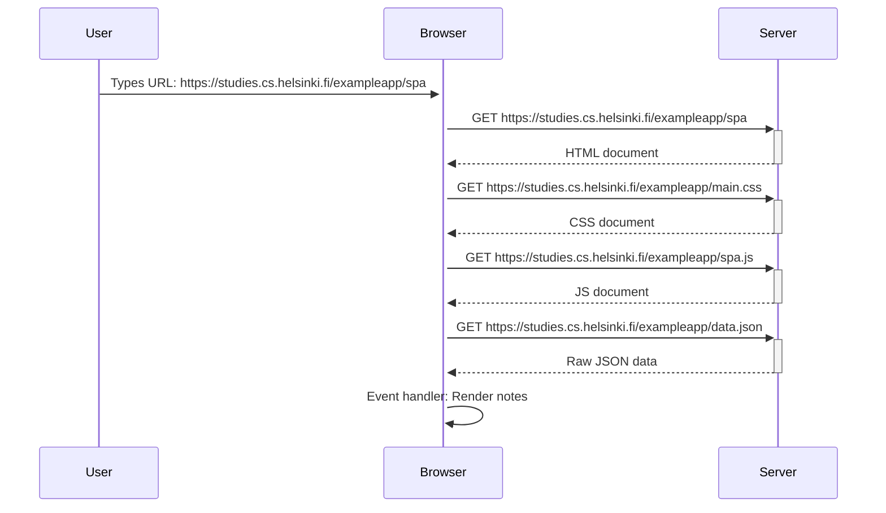

```mermaid
sequenceDiagram
    participant User
    participant Browser
    participant Server

    User->>+Browser: Types URL: https://studies.cs.helsinki.fi/exampleapp/spa
    Browser->>+Server: GET https://studies.cs.helsinki.fi/exampleapp/spa
    Server-->>-Browser: HTML document
    Browser->>+Server: GET https://studies.cs.helsinki.fi/exampleapp/main.css
    Server-->>-Browser: CSS document
    Browser->>+Server: GET https://studies.cs.helsinki.fi/exampleapp/spa.js
    Server-->>-Browser: JS document
    Browser->>+Server: GET https://studies.cs.helsinki.fi/exampleapp/data.json
    Server-->>-Browser: Raw JSON data
    Browser->>Browser: Event handler: Render notes

```
