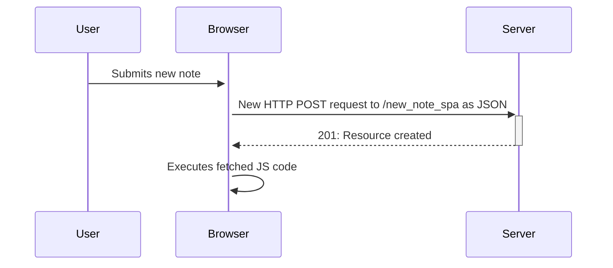

```mermaid
sequenceDiagram
    participant User
    participant Browser
    participant Server

    User->>+Browser: Submits new note
    Browser->>+Server: New HTTP POST request to /new_note_spa as JSON
    Server-->>-Browser: 201: Resource created
    Browser->>Browser: Executes fetched JS code
```
